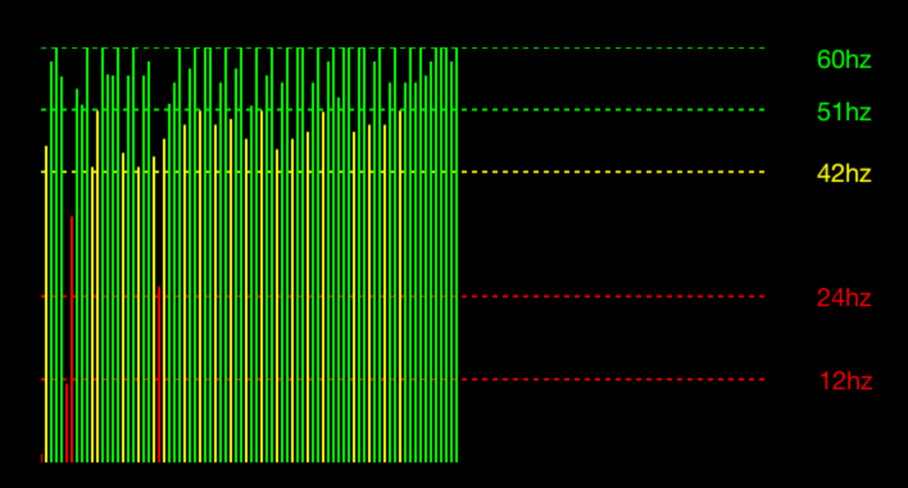

#### 一个可视化的帧率仪表,类似于小米手机的Frame Rate Monitor Tools



- 前后台切换自动隐藏

- 长按关闭

- 双击清除数据

- 自由拖拽位置
  
  

FPSMonitor APIS

```textile
FPSMonitor#getInstance
FPSMonitor#setLayoutPosition
FPSMonitor#setColorEvaluator
FPSMonitor#isRunning
FPSMonitor#start
FPSMonitor#stop
FPSMonitor#show
FPSMonitor#destroy
FPSMonitor#getTotalDropped
FPSMonitor#getTotalFrames
FPSMonitor#getTotalFrameInfoCount
FPSMonitor#getFrameRate
FPSMonitor#getRunningTimeInMillis
FPSMonitor#clear
FPSMonitor#hide
```